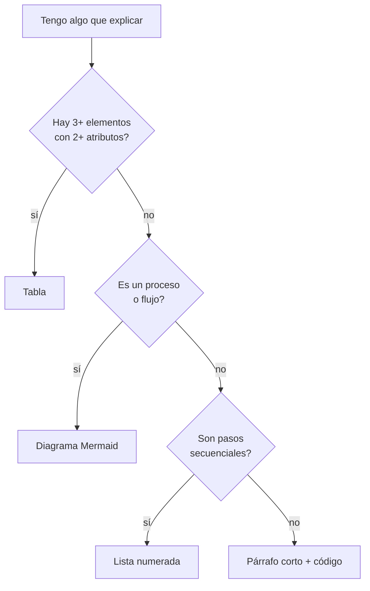

# formation-content-writer

Reglas de estilo para generar contenido didáctico del curso de Claude Code de Power Fox BI. Este repo es **público**: lo que se escribe aquí lo lee cualquiera.

## Cuándo usar esta skill

- README de sesión, demo o carpeta de alumno
- Presentaciones HTML en `/sesiones/`
- Guías, cheatsheets, explicaciones paso a paso
- Prompts en `/prompts/`
- Resúmenes o recaps de sesión
- Cualquier texto que vaya a leer un alumno o un cliente

No aplicar a: commits, issues, PRs internos o mensajes efímeros (ahí basta con Conventional Commits y ser claro).

## Reglas duras

| # | Regla | Cómo aplicarla |
|---|---|---|
| 1 | Idioma | Español siempre, incluidos títulos y ejemplos |
| 2 | Tono | Directo, profesional, sin corporativismo vacío |
| 3 | Orden | Ejemplo concreto antes que teoría |
| 4 | Listas | Máximo 6 items — si hay más, agrupar o convertir en tabla |
| 5 | Código | Bloque con lenguaje especificado, comentar solo lo no obvio |
| 6 | Markdown | Un único H1 por documento, jerarquía limpia H2/H3 |
| 7 | Diagramas | Mermaid cuando comunique mejor que texto o tabla |
| 8 | Tablas | Cuando haya 3+ elementos comparados con 2+ atributos |
| 9 | Énfasis | **Negrita** para conceptos clave, nunca decorativa |
| 10 | Privacidad | Cero datos reales de clientes, usar placeholders |

## Lo que no se hace

- Emojis decorativos (uno o dos por sección, solo si aportan)
- Bullets de una palabra suelta (`- Rápido` `- Fácil` `- Potente`)
- Aperturas tipo "En el dinámico mundo de la IA…", "En la era de…"
- Párrafos de más de 80 palabras sin descanso visual (lista, código o diagrama)
- Inventar datos de clientes, GUIDs, URLs internas o credenciales

## Patrón base de un documento

```markdown
# Título del documento

Una frase que resume de qué va esto y para quién.

## Ejemplo rápido

[bloque de código o demo concreta que el lector entiende en 30 segundos]

## Cómo funciona

[explicación corta, con lista o tabla si hay comparación]

## Cuándo usarlo / cuándo no

[criterios prácticos]

## Referencias

[enlaces internos del repo o docs oficiales]
```

## Antes / después

**Antes (decorativo, vago, en inglés, lista larga):**

```markdown
# 🚀 Claude Code: The Future of AI Coding ✨

En el dinámico mundo del desarrollo moderno, Claude Code emerge como…

Features:
- Fast
- Smart
- Powerful
- Flexible
- Modern
- Scalable
- Extensible
- Integrated
```

**Después (directo, concreto, lista agrupada):**

```markdown
# Claude Code en 5 minutos

Claude Code es una CLI que ejecuta tareas de desarrollo con acceso a tu repo y a tus herramientas.

## Qué resuelve

| Caso | Antes | Con Claude Code |
|---|---|---|
| Refactor mediano | 2h manual | Prompt + revisión |
| Generar tests | Se olvidan | Se piden en PR |
| Auditar un script | Abrir archivo por archivo | Se pide un resumen |

## Cuándo no usarlo

Tareas críticas sin revisión humana, código con datos reales de clientes, secretos.
```

## Placeholders para ejemplos

Cuando necesites datos de ejemplo, usa siempre ficticios:

- Cliente: `Acme Corp`, `Contoso`
- Persona: `Ana López`, `Juan Pérez`
- Email: `ana@example.com`
- GUID: `00000000-0000-0000-0000-000000000000`
- URL: `https://ejemplo.internal`
- API key: `sk-xxxxx-placeholder`

## Cuándo elegir formato



## Checklist antes de commitear

- [ ] Todo está en español
- [ ] H1 único, jerarquía coherente
- [ ] Ninguna lista supera 6 items
- [ ] Los ejemplos van antes que la teoría
- [ ] Bloques de código con lenguaje especificado
- [ ] Ningún dato real de cliente, GUID, URL interna o credencial
- [ ] No hay párrafos de +80 palabras sin descanso visual
- [ ] Las negritas marcan conceptos, no decoran

## Rationalizations a evitar

| Excusa | Realidad |
|---|---|
| "Es solo un README, no hace falta tanto" | Los alumnos copian el estilo del repo. Mantén el listón. |
| "La lista tiene 7 items pero están relacionados" | Agrúpalos en 2 sub-listas o conviértelos en tabla. |
| "Este dato de cliente es inofensivo" | Repo público. Si dudas, placeholder. |
| "Queda soso sin emojis" | La claridad no es sosería. Un emoji solo si guía la lectura. |
| "Lo explico en inglés porque el término es técnico" | Término técnico en inglés ok; explicación en español. |
