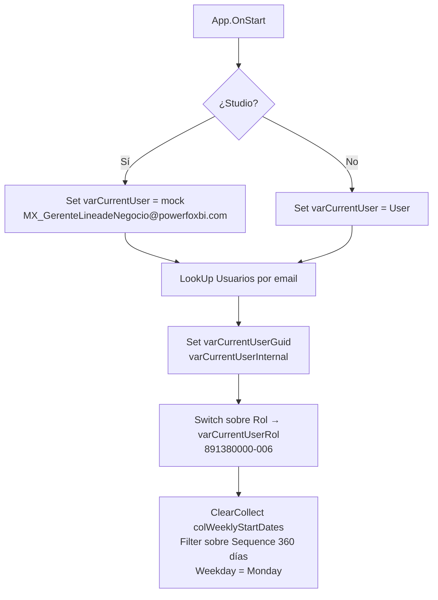
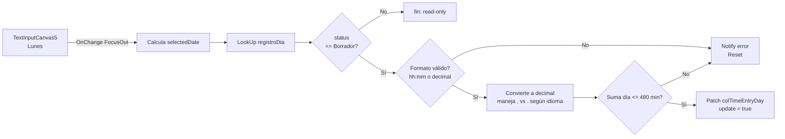

# Análisis técnico — Canvas App "Registro Semanal de Horas" (Time Tracker)

> Documento de apoyo para la **Sesión 4 — Lunes** del curso de Claude Code (Power Fox BI).
> Sirve como caso real para discutir cómo Claude puede analizar, refactorizar y documentar Canvas Apps complejas a partir del YAML extraído del `.msapp`.

---

## 1. Contexto

- **Solución Dataverse:** `smart_project_solution`
- **Canvas App:** `pfx_weeklytimeentrypage_40d1a` (DisplayName: *"Registro Semanal de Horas"*)
- **Tipo:** Canvas App embebida en Model-Driven App (CanvasAppType=2, formato tablet 1366×768)
- **Versión:** 2026-03-20 — Studio 3.26033.6
- **Tablas Dataverse implicadas:** `pfx_time_entry` (cabecera semanal), `pfx_time_entry_day` (registro diario por actividad), `pfx_project`, `pfx_project_activity`, `pfx_project_team_member`, `pfx_team_template`, `pfx_team_template_member`, `systemuser`.
- **Conector clave:** `Environment.pfx_post_powerfox_api` — conector personalizado que ejecuta `fetchxml`, `create` y `update` con impersonación.

La app sirve **tres roles de usuario** desde una única pantalla:

| Rol | Qué puede hacer |
|---|---|
| Recurso de proyecto | Registrar y editar sus propias horas, enviar a aprobación |
| Coordinador / Gerente / Gestor de proyectos | Registrar horas en nombre de otros miembros del equipo |
| Aprobador (miembro de plantilla de aprobación) | Ver, aprobar o rechazar partes enviados |

---

## 2. Estructura del documento `.msapp`

```
Src/
├── App.pa.yaml          ← OnStart (94 líneas)
├── Screen1.pa.yaml      ← Toda la app (3.414 líneas, 247 KB)
├── Screen2.pa.yaml      ← Vacía (placeholder)
└── _EditorState.pa.yaml
Controls/  Resources/  References/
Header.json  Properties.json  AppCheckerResult.sarif
```

**Observación relevante:** prácticamente toda la lógica vive en una sola pantalla con popups condicionales (`Visible: =isXxxPopupVisible`). No hay componentes reutilizables; los siete días de la semana están **duplicados como contenedores hermanos** `Container4` … `Container4_6` con ~110 líneas casi idénticas cada uno.

---

## 3. Flujo `App.OnStart`



**Puntos a destacar en formación:**

1. **Detección Studio vs Player** mediante `StartsWith(Host.Version, "PowerApps-Studio")` para inyectar usuario fake en desarrollo. Patrón limpio.
2. **Mapeo de Choice de rol a número** con `Switch`, devolviendo el código que luego se reenvía como string al API personalizado.
3. **Generación de inicios de semana** por filtrado de `Sequence(360)` con `Weekday(..., StartOfWeek.Monday) = 1`. Funciona, pero genera 360 fechas en memoria solo para quedarse con ~52. Candidato a refactor (`ForAll(Sequence(52), DateAdd(Today(), -7*Value, ...))`).

---

## 4. Modelo de datos (Dataverse)

### `pfx_time_entry` (cabecera semanal)

| Campo | Tipo | Notas |
|---|---|---|
| `pfx_time_entryid` | GUID | PK |
| `pfx_user_id` | Lookup → systemuser | Recurso titular |
| `pfx_project_id` | Lookup → pfx_project | Proyecto del parte |
| `pfx_week_start_date` | Date | Lunes de la semana |
| `pfx_total_hours` | Decimal | Suma calculada y persistida desde la app |
| `pfx_role_choice` | Choice | Rol del recurso al registrar (snapshot) |
| `pfx_time_entry_status_choice` | Choice | **891380000=Borrador, 891380001=Enviado, 891380002=Aprobado, 891380003=Rechazado** |
| `pfx_approval_requested_on` / `pfx_approved_on` | Date | |
| `pfx_approved_by_id` | Lookup → systemuser | |
| `pfx_approval_comments` | Text | |

### `pfx_time_entry_day` (línea diaria)

| Campo | Tipo | Notas |
|---|---|---|
| `pfx_time_entry_dayid` | GUID | PK |
| `pfx_time_entry_id` | Lookup → pfx_time_entry | FK a cabecera |
| `pfx_user_id` | Lookup → systemuser | |
| `pfx_project_id` | Lookup → pfx_project | |
| `pfx_project_activity_id` | Lookup → pfx_project_activity | Actividad del proyecto |
| `pfx_entry_date` | Date | Día concreto |
| `pfx_total_hours` | Decimal | Horas registradas en ese día/actividad |
| `pfx_comment` | Text | Comentario por celda |

### Relación de aprobación

```
pfx_project --(pfx_timesheet_approver_team_template_id)--> pfx_team_template
                                                            └── pfx_team_template_member ── systemuser
```

Un proyecto apunta a una plantilla de equipo; los miembros de esa plantilla son los aprobadores válidos del parte de horas de cualquier recurso que cargue horas a ese proyecto.

---

## 5. Pantalla principal — anatomía

```
Screen_Container (vertical AutoLayout)
├── HeaderContainer1                    ← Título "Registro Semanal de Horas - {usuario}"
├── HeaderContainer1_1 (toolbar 1)
│   ├── ComboboxCanvas1                 ← Selector de semana (colWeeklyStartDates)
│   ├── ButtonCanvas1                   ← "Nueva Actividad" (abre popup)
│   ├── ButtonCanvas_SaveTimeEntry      ← "Guardar" (visible solo si hay cambios pendientes)
│   ├── ButtonCanvas_Sources            ← Botón oculto que recarga TODAS las colecciones
│   └── ButtonCanvas1_1                 ← "Actualizar" (Select(ButtonCanvas_Sources))
├── HeaderContainer1_2 (toolbar 2)
│   ├── TextCanvas2                     ← "Del dd-mm-yyyy al dd-mm-yyyy"
│   ├── TextCanvas2_1                   ← "Total de horas: hh:mm"
│   ├── ComboboxCanvas3                 ← Selector usuario (impersonación admin)
│   └── ButtonCanvas7                   ← "Aprobar" en bloque (BulkApprove=true)
├── MainContainer1
│   ├── Container1                      ← Cabecera tabla: Proyecto | L M X J V S D | Estado
│   └── Gallery1                        ← Galería de filas (GroupBy proyecto+actividad)
│        └── Container2 (template)
│             ├── TextCanvas4           ← "Proyecto | Actividad"
│             ├── Container4   (Lunes)  ← 7 contenedores hermanos casi idénticos
│             ├── Container4_1 (Martes)
│             ├── ...
│             ├── Container4_6 (Domingo)
│             └── Container4_7          ← Botón estado/abrir detalle
├── Container1_1                        ← Footer (totales por día / semana)
├── CommentPopup_Container              ← isCommentPopupVisible
├── ActivityDetails_Container           ← isActivityDetailsPopupVisible (aprobación)
├── NewActivity_Container               ← isNewActivityPopupVisible
└── Container_Spinner                   ← varSpinnerVisible
```

---

## 6. Carga de datos — `ButtonCanvas_Sources`

Es el corazón funcional: **un único botón oculto** que ejecuta seis llamadas FetchXML al conector personalizado y reconstruye todas las colecciones locales.

| # | Variable / Colección | FetchXML | Propósito |
|---|---|---|---|
| 1 | `colTimeSheetHeader` | `pfx_time_entry` filtrado por `ownerid` y `pfx_week_start_date`, joins a `pfx_project` y `pfx_team_template` | Cabeceras de la semana visible |
| 2 | `colTimeSheetApprovers` | `pfx_team_template_member` por proyecto/plantilla | Aprobadores válidos por proyecto |
| 3 | `colProjectsUsersToApprove` | `pfx_project_team_member` para proyectos donde el usuario es aprobador | Usuarios cuyas horas puede aprobar |
| 4 | `colProjects` | `pfx_project` donde el usuario es miembro | Proyectos accesibles |
| 5 | `colProjectActivities` | `pfx_project_activity` por proyecto accesible | Actividades por proyecto |
| 6 | `colProjectsAdminUser` + `colProjectsUsers` | `pfx_project_team_member` con `pfx_role_in_project_choice IN (891380000, 891380006, 891380007)` | Si es Coordinador/Gerente/Gestor → puede registrar en nombre de otros |
| 7 | `colTimeEntryDay` | `pfx_time_entry_day` filtrado por owner + rango lunes-domingo | Líneas diarias de la galería |

**Patrón repetido:** `Set(varXxxResponse, Environment.pfx_post_powerfox_api({ActionType:"fetchxml", InputData:"<fetch>...</fetch>"}))` → `ClearCollect(colXxx, ForAll(ParseJSON(varXxxResponse.Result_String), {...}))`.

**Observaciones:**

- Las fechas vienen como string ISO y se reconstruyen con `Date(Value(Left(Mid(...,1,10),4)), Value(Mid(...,6,2)), Value(Mid(...,9,2)))`. Frágil si el conector cambia el formato.
- No hay `Concurrent()` — las 6-7 llamadas se hacen secuenciales aunque varias son independientes. Latencia visible.
- El spinner se activa al inicio y se desactiva al final, pero las llamadas intermedias no informan progreso.

---

## 7. Edición de horas — celda Lunes (resto idénticas)



**Puntos didácticos:**

1. **Validación regex doble formato** (`hh:mm` y decimal) con normalización de coma/punto según `Language()`.
2. **Tope diario por suma** — antes de aceptar, suma todas las celdas del día (sustituyendo la celda editada por el nuevo valor) y rechaza si supera 480 min.
3. **Marca dirty con campo `update: "true"`** dentro de la colección local — permite que el botón Guardar sólo envíe filas modificadas.
4. **DisplayMode condicionado al estado de la cabecera** — si el `pfx_time_entry_status_choice ≠ 891380000` (Borrador), todo el día queda read-only.

---

## 8. Guardado — `ButtonCanvas_SaveTimeEntry`

Construye **tres payloads JSON** distintos y los envía en serie:

| Payload | Tabla | Campos | Por qué separado |
|---|---|---|---|
| `updateTimeEntriesDayHoursPayload` | `pfx_time_entry_day` | `pfx_total_hours` | Sólo registros con `update="true"` |
| `updateTimeEntriesDayCommentsPayload` | `pfx_time_entry_day` | `pfx_comment` | Comentario por separado para "evitar conflictos estructurales" |
| `updateTimeEntriesHeaderPayload` | `pfx_time_entry` | `pfx_total_hours` (recalculado con `Sum(Filter(colTimeEntryDay, pfx_time_entry_id = pfx_time_entryid), pfx_total_hours)`) | Mantiene la cabecera coherente con la suma de líneas |

Tras los tres `Environment.pfx_post_powerfox_api`, recarga todo via `Select(ButtonCanvas_Sources)` y notifica.

**Comentario para refactor:** la cabecera **debería calcularse server-side** mediante un Power Automate o un plugin Dataverse en pre-update de las líneas. La app no debería ser quien mantiene la integridad del total.

---

## 9. Flujo de aprobación

### Envío a aprobación (recurso → estado *Enviado*)
- En el popup `ActivityDetails_Container`, botón "Enviar a aprobar".
- Validación: `TotalWeeklyHours >= 40`. Si no, `Notify` rojo.
- Update de `pfx_time_entry_status_choice` → `891380001` y `pfx_approval_requested_on = Now()`.

### Aprobación (aprobador)
- Botón visible solo si el usuario aparece en `colTimeSheetApprovers` para el proyecto.
- Soporta dos modos:
  - **Individual** (`BulkApprove = false`): aprueba/rechaza la cabecera abierta en el popup.
  - **En bloque** (`BulkApprove = true`, desde `ButtonCanvas7` "Aprobar" del header): aprueba todas las cabeceras `pfx_time_entry_status_choice = 891380001` cuyos proyectos están en la lista de aprobables del usuario.
- En ambos casos: status → `891380002` (Aprobado) o `891380003` (Rechazado), `pfx_approved_by_id`, `pfx_approved_on`, `pfx_approval_comments`.

### Re-edición tras Aprobado/Rechazado
- Botón "Editar" visible si `status in [891380002, 891380003]`.
- Devuelve cabecera a `891380000` (Borrador) y reactiva `statecode=0/statuscode=1`.

---

## 10. Nueva actividad — `ButtonCanvas3_7`

El botón "Guardar" del popup **Nueva actividad** contiene la lógica más densa de la app (~120 líneas en una sola fórmula `OnSelect`). Resumen del `Switch(true, ...)`:

```mermaid
flowchart TD
    A[Click Guardar] --> B[LookUp draftTimeSheetHeader<br/>cabecera Borrador para proyecto+semana]
    A --> C[LookUp nonDraftTimeSheetHeader<br/>cabecera no-Borrador]
    B & C --> D{¿draft existe?}
    D -- Sí --> E[Select ButtonCanvas_CreateActivity<br/>crea 7 pfx_time_entry_day x 0h]
    D -- No --> F{¿nonDraft existe?}
    F -- Sí --> G[Notify error<br/>"solo se añaden a Borrador"]
    F -- No --> H[POST create cabecera pfx_time_entry<br/>con pfx_role_choice = varCurrentUserRol]
    H --> I[POST create 7 pfx_time_entry_day<br/>recordid de la cabecera recién creada]
    E & H & I --> Z[Select ButtonCanvas_Sources<br/>recarga + cierra popup]
```

**Detalle interesante:** el `recordid` de la cabecera se obtiene parseando la respuesta del primer `create` con `Text(ParseJSON(createTimeEntryHeaderResponse).recordid)`. Acoplamiento al contrato del conector personalizado.

---

## 11. Hallazgos para discutir en sesión

### Fortalezas

1. **Separación clara de responsabilidades** entre cabecera (`pfx_time_entry`) y línea (`pfx_time_entry_day`).
2. **Conector personalizado único** (`pfx_post_powerfox_api`) con `ActionType` (fetchxml/create/update) — fácil de auditar y de reemplazar.
3. **Detección Studio/Player** para acelerar desarrollo sin tocar producción.
4. **Validación cliente robusta** del input de horas (regex + tope 8h/día).
5. **Modo de aprobación dual** (individual y en bloque) bien resuelto con un único popup y la variable `BulkApprove`.

### Deuda técnica clara

| # | Problema | Impacto | Refactor sugerido |
|---|---|---|---|
| 1 | **Siete contenedores hermanos** `Container4..Container4_6` con ~110 líneas casi idénticas cada uno | ~770 líneas duplicadas; cualquier cambio se aplica 7 veces | Componente lienzo `cmpDayCell` con propiedad de entrada `dayOffset` (0..6) |
| 2 | **Toda la app en `Screen1`** (3.414 líneas) | Imposible localizar nada sin grep | Mover popups a su propia screen o componente |
| 3 | **Llamadas FetchXML secuenciales** en `ButtonCanvas_Sources` | Latencia perceptible al cambiar de semana | `Concurrent()` para las 6 que son independientes |
| 4 | **Cabecera total recalculada en cliente** | Riesgo de incoherencia si dos usuarios editan el mismo parte | Plugin Dataverse pre-update sobre `pfx_time_entry_day` |
| 5 | **Parsing manual de fechas ISO** repetido 6+ veces | Frágil ante cambios del conector | Función `parseIsoDate` como `Set` global, o devolver fechas ya nativas desde el conector |
| 6 | **`colWeeklyStartDates` genera 360 fechas para quedarse con 52** | Memoria innecesaria | `Sequence(52)` con paso 7 directo |
| 7 | **`pfx_role_choice` mapeado en cliente** vía `Switch` | Si añaden un rol nuevo, hay que actualizar la app | Devolver el código directamente desde Dataverse o desde el OptionSet |
| 8 | **Estados como números mágicos** (891380000…003) repetidos 20+ veces | Si Microsoft cambia el OptionSet o se renombra, hay que buscar manualmente | Constantes en `App.OnStart` (`Set(STATUS_DRAFT, 891380000)…`) |
| 9 | **OnSelect de "Guardar" con 120 líneas** anidadas | Difícil de testar mentalmente | Extraer a fórmulas con nombre (Power Fx UDFs) |
| 10 | **Sin manejo de errores de red** | Si una llamada al conector falla, las siguientes ven datos parciales | `IfError` envolviendo cada llamada y rollback de la colección local |

### Riesgos funcionales

- La validación "≥ 40 horas para enviar a aprobar" está hardcodeada y rompe para jornadas reducidas o festivos.
- Si un proyecto no tiene `pfx_timesheet_approver_team_template_id`, los registros nunca podrán aprobarse — la app no lo avisa al cargar.
- `BulkApprove = true` aprueba **todos** los proyectos aprobables del usuario en esa semana sin permitir excluir alguno.

---

## 12. Cómo usar este documento en sesión

### Bloque 1 (15 min) — Lectura guiada del YAML
- Abrir el `.msapp` con 7-Zip → `Src/Screen1.pa.yaml`.
- Mostrar cómo Claude puede recorrer 3.400 líneas de YAML y mapear estructura a los diagramas de las secciones 5 y 6.
- Prompt sugerido: *"Léeme `Src/Screen1.pa.yaml` y dame el árbol de contenedores con un resumen de qué hace cada uno en una línea."*

### Bloque 2 (20 min) — Refactor del componente "día"
- Hallazgo #1 de la tabla anterior. Pedir a Claude que genere un componente lienzo equivalente a `Container4`.
- Discutir qué propiedades de entrada necesitaría (`dayOffset`, `currentItem`, `varCurrentStartWeekSelected`, `colTimeEntryDay`).
- Comparar lo que sale con `Container4` original.

### Bloque 3 (15 min) — Detección de bugs latentes
- Pedir a Claude que liste **todas las apariciones de los códigos de estado mágicos** y proponga la refactorización con constantes.
- Discutir el riesgo del hallazgo #4 (cabecera recalculada en cliente) y dibujar la solución server-side.

### Bloque 4 (10 min) — Generación de tests / casos de prueba
- A partir del análisis, pedir un **plan de pruebas de regresión** con casos por rol, estado y combinaciones (recurso normal, coordinador con impersonación, aprobador sin proyectos asignados, BulkApprove con cero candidatos…).

---

## 13. Apéndice — Códigos de Choice usados

### `pfx_time_entry_status_choice`

| Código | Estado |
|---|---|
| 891380000 | Borrador |
| 891380001 | Enviado |
| 891380002 | Aprobado |
| 891380003 | Rechazado |

### `pfx_role_choice` (Rol de recurso en actividad)

| Código | Rol |
|---|---|
| 891380000 | Manager |
| 891380001 | Senior |
| 891380002 | Medium |
| 891380003 | Junior |
| 891380004 | CAD & Edición |
| 891380005 | Consultoría España |
| 891380006 | NA |

### `pfx_role_in_project_choice` (filtro admin)

| Código | Rol en proyecto |
|---|---|
| 891380000 | Coordinador |
| 891380006 | Gerente de línea de negocio |
| 891380007 | Gestor de proyectos |

---

*Documento generado para la formación del 2026-05-05. Basado en versión de Canvas App `2026-03-20T00:16:21Z` extraída desde `C:\Dev\clients\litoclean-tema\solutions\smart_project_solution\CanvasApps\pfx_weeklytimeentrypage_40d1a_DocumentUri.msapp`.*
